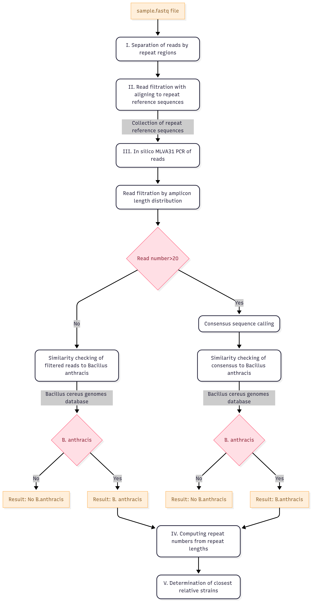

# **Bant_MLVA31_analyzer**

## **Description**

Bant_MLVA31_analyzer is a pipeline for determining repeat numbers for 31 _Bacillus anthracis_ VNTR loci from reads generated by [Nanopore](https://nanoporetech.com/) with PCR amplicon sequencing method directly from environmental samples containing _Bacillus anthracis_ strains. Before calculation of repeat units the pipeline generates consensus sequences of repeat regions and checks the similarity to _Bacillus anthracis_. Optionally, the pipeline determines the 20 closest relatives from a global _B. anthracis_ database containing MLVA data of 523 strains with known geographic origin.

#### **Background**

Multiple-Locus Variable Number of Tandem Repeats (VNTR) Analysis (MLVA) is one of the gold standard strain-level subtyping methods for outbreak-related _Bacillus anthracis_ strains. The MLVA genotype of different _Bacillus anthracis_ strains is described by repeat numbers of 31 VNTR loci. 62 primers are used for defining the length of 31 _Bacillus anthracis_ VNTR loci, according to MLVA31 typing scheme described by Beyer et al. 2012. The length of amplicons generated by 31 primer pairs flanking repeat regions is used for calculation of repeat numbers and can be easily determined by _in silico_ PCR of raw long reads or assembled genomes generated by NGS of clear isolates of _Bacillus anthracis_ strains. However the simple _in silico_ PCR based pipelines are not suitable for MLVA typing of NGS reads generated from _Bacillus anthracis_-containing DNA isolated directly from environmental samples due to high level of contamination with other _Bacillus cereus_-group strains. Some of 31 VNTR loci are presented not only in _Bacillus anthracis_ strains because of high similarity between the genomes of _Bacillus cereus_-group members and this results false amplicons and incorrect determination of repeat numbers.

#### **Workflow**

Main steps of analysis:

I.   Separation of reads by repeat regions

II.  Read filtration with aligning to collection of repeat reference sequences

III. _In silico_ MLVA31 PCR of reads, filtration of reads by amplicon length distribution and determination of the most frequent amplicon length
     
   - Depending on the number of filtered reads:
        * Read number > 20: Consensus sequence calling, checking similarity of consensus to _Bacillus anthracis_, and determination of repeat length from consensus
        * Read number < 20: Checking similarity of filtered reads to _Bacillus anthracis_, and determination of repeat length directly from reads

IV.   Computing repeat numbers (units) from repeat lengths

V.  Determination of closest relative strains





Detailed workflow of the script is presented in Documents/Bant_MLVA31_analyzer_workflow.pdf

## **Requirements**

* The script is compatible with GNU/Linux distribution. We tested the script under Ubuntu 20.04 LTS, 21.04, 21.10 and 22.04 LTS versions

* R >=4.2.1. (https://www.R-project.org)

* minimap2 >=2.17 (https://github.com/lh3/minimap2)

* samtools >=1.10 (http://www.htslib.org/) 
 
* primersearch from EMBOSS >= 6.6.0.0. (http://emboss.sourceforge.net/download/)

* Cutadapt >= 3.2 (https://github.com/marcelm/cutadapt/)
   
* seqtk >= 1.3  (https://github.com/lh3/seqtk.git)

* Standalone command-line BLAST (BLAST+) >= 2.10.1+ (https://ftp.ncbi.nlm.nih.gov/blast/executables/blast+/)

* amplicon_sorter = 2025/05/28 release (https://github.com/avierstr/amplicon_sorter)
     * the `amplicon_sorter.py` script is found in the Script_directory.
 
Before installation and usage of the script, ensure all of the programs listed above (except from `amplicon_sorter.py`) are accessible from your local `$PATH`.
If you download or compile these binaries without installing them to /usr/bin/, you must add them to your local `$PATH`.

## **Installation**

#### **1. Clone the repository and enter the directory:**

To install Bant_MLVA31_analyzer, clone this repository using git:
```bash
git clone https://github.com/nagyagnes/Bant_MLVA31_analyzer.git
```
To make `Bant_MLVA31_analyzer.sh` globally available, it should be added to `$PATH`, e.g. assuming you are in the directory where `Bant_MLVA31_analyzer.sh` is located, you should run:
```
export PATH=$(realpath ./):$PATH
```
Optionally, the export can be made permanent by adding the above line to your `.bashrc`, which is probably located in `$HOME/.bashrc`.

#### **2. Download and create the required database:**

The script relies on [Bcereus_genomes database](https://zenodo.org/records/17078231), which contains complete and chromosome level assembled genomes of Bacillus cereus group bacilli available at [NCBI Datasets Genome](https://www.ncbi.nlm.nih.gov/datasets/genome/?taxon=86661&assembly_level=2:3)
To download and create the database, run:
```bash
cd Bant_MLVA31_analyzer
./download_create_blast_database.sh
```
#### **3. Test:** 

The installation can be tested by running:
```bash
cd Bant_MLVA31_analyzer
./test_script.sh
```
The test script takes two `.fastq` files from the Demo_files directory (`Test_1.fastq`, `Test_2.fastq`) with raw sequencing reads of two _Bacillus anthracis_ samples, and executes `Bant_MLVA31_analyzer.sh` for all of them. Then it compares the results with the expected output files in Demo_files/Demo_results/. If the results match, the script should report: "Test successful.". In case of differences, the test fails and the script reports "Test failed: differences found. Check dependencies.", the dependencies should be double checked. If the test script fails, please check the test log carefully.

#### Using Apptainer

Alternatively, a container for `Bant_MLVA31_analyzer` can be built in which all dependencies are installed and which has the advantage of being portable (i.e. it can be moved between computers without having to reinstall dependencies). To do this, you should clone the repository (as described above) and assuming Apptainer (formerly Singularity) is installed the container can be built running the following command:

`cd Bant_MLVA31_analyzer && apptainer build Bant_MLVA31_analyzer.sif apptainer.def`

The container should already have the required BLAST database, but can also be created with the following command:

`apptainer exec Bant_MLVA31_analyzer.sif ./download_create_blast_database.sh`

In this case, please run the test as follows:

`apptainer exec Bant_MLVA31_analyzer.sif ./test_script.sh`

If you do not need the database in the container, please remove the following lines from `apptainer.def`:
```
78 cd /opt/Bant_MLVA31_analyzer 79 ./download_create_blast_database.sh
```
Using the container, the main script `Bant_MLVA31_analyzer.sh` can be executed in the following way:

`apptainer exec Bant_MLVA31_analyzer.sif -p /opt/Bant_MLVA31_analyzer/Supporting_files -d /opt/Bant_MLVA31_analyzer/Script_directory Bant_MLVA31_analyzer.sh`

An interactive shell can also be opened in the container by executing `apptainer shell Bant_MLVA31_analyzer.sif`, which makes all dependencies and the main script accessible on the command line for more flexible use.

## **Usage**

#### **Input**

The script accepts one `.fastq` file per each sample containing all passed Nanopore reads after basecalling and demultiplexing (in case of multiple samples)
By default, input `<sample>.fastq` file for each sample should be located in Bant_MLVA31_analyzer/Output_directory. The location of the input files can be changed using `-o your/path/to/directory of input files`. 

#### **Command**

`Bant_MLVA31_analyzer.sh -s <sample1>,<sample2>,... -m Y -i Y`

#### **Options**

The list of options can be found in the help menu (by running `Bant_MLVA31_analyzer.sh -h`):
```
Bant_MLVA31_analyzer -- performs 31-loci MLVA typing for Bacillus anthracis directly from ONT reads from environmental samples, and finds the closest relative strains
 Version 2025-08-26
 
 Options: [-h] [-s -p -d -o -m -i]
 where:
 -h=Prints this help text
 -s=Set a name or number for sample which is the name of the input.fasq file [Required]
 -p=Set the directory for supporting files [Default: Supporting_files]
 -d=Set the directory for scripts [Default: Script_directory]
 -o=Set the output directory which contains input sample.fastq file and will contain output directories for intermediate and result files [Default: Output_directory]
 -m=Determine the closest neighbour strain from global Bacillus anthracis database [Required, Y=yes, N=no]
 -i=Keep intermediate files and directories created during analysis [Required, Y=yes, N=no]
```

#### **Directories**

* Bant_MLVA31_analyzer/Supporting_files: contains reference sequences for mapping, primer sequences for _in silico_ PCR, and calculation template for converting amplicon lengths to repeat numbers (units)

   * `BaAmesAncestor.fasta`: _Bacillus anthracis_ str. 'Ames Ancestor' reference genome sequence (NCBI Reference Sequence Accession NC_007530.2)
   * `BaAmes_MLVA_regions.txt`: name and position of repeats on _Bacillus anthracis_ reference genome, in the same order as given in `$repeats` variable
   * `<repeat>_ref.fasta` files: reference sequence collection of each of 31 VNTR region indexed by `minimap2`
   * Bant_MLVA31_analyzer/Supporting_files/Primer_files subdirectory: contains files with primer sequences for _in silico_ PCR and trimming:
        * `<repeat>_primer` files: a tab-delimited file for _in silico_ PCR for each of 31 repeats with name, forward and reverse sequences of primers flanking the given repeat region. These primer sequences are used in original _Bacillus anthracis_ MLVA31 typing scheme described by Beyer et al. 2012.
        * `<repeat>_primercut.txt` files: 22-25 base long sequences of forward and reverse primers 5' ends for trimming with `Cutadapt`
   * `Bcereus_genomes`: database used in offline blast is downloaded and created with `download_create_blast_database.sh` script
   * `BaMLVA_genotypes_ref.csv`, `BaMLVA31_genotypes_R.csv`: in-house _Bacillus anthracis_ MLVA database with MLVA profiles of 523 strains with known geographic origin
           
* Bant_MLVA31_analyzer/Script_directory:

   * contains R scripts and `amplicon_sorter.py` script
   * contains `Calculation_template.csv`: template file used by R for calculation of repeat units from _Bacillus anthracis_ str. 'Ames Ancestor' reference genome sequence by coding convention from Thierry et. al 2014. This file should be in the same directory as R scripts.

* Bant_MLVA31_analyzer/Documents:

   * `Bant_MLVA31_analyzer_workflow.pdf`
   * `BaMLVA_ref_seq_collection.xlsx`: detailed data about the used reference sequences in `<repeat>_ref.fasta` files
   * `BaMLVA_genotypes_ref.xlsx`: detailed information about data sources of in-house _Bacillus anthracis_ MLVA database with MLVA profiles of 523 strains with known geographic origin

## **Output**


#### **Result files**

The result files will be created for each sample separately in Bant_MLVA31_analyzer/Output_directory/<Sample>/Results directory.

* `<sample>_final_results.csv` file: contains MLVA result table with columns Repeat Name; Repeat Length; Repeat Unit Number; Comment, and contains table with the name, canSNP type, geographical origin and MLVA data of 20 closest neighbour strains (if it was chosen in options)

* comment: for each repeat specifies the operational route of script on which the results were generated in the III. step. 
          
    * `Consensus_Bant`: consensus sequence is called for the repeat, and it has the highest similarity with _Bacillus anthracis_.
    * `No_cons_Bant`: consensus sequence calling is failed, the repeat number is determined directly from reads, and the reads have the highest similarity with _Bacillus anthracis_.
    * `No_cons_NoBant`: consensus sequence is called for the repeat, but both the consensus and the reads have the highest similarity with Bacillus cereus-group member other than _Bacillus anthracis_. The repeat number can not be determined.
    * `No_cons_LowReadBant`: the read number is too low for consensus calling, the repeat number is determined directly from reads, and the reads have the highest similarity with _Bacillus anthracis_.
    * `No_cons_LowReadNoBant`: the read number is too low for consensus calling, the reads have the highest similarity with Bacillus cereus-group member other than _Bacillus anthracis_. The repeat number can not be determined.
    * `No_Read`: there are no reads, the repeat number can not be determined.


* `<sample>_<repeat>_cons.fasta` files: Consensus sequences of repeat regions (if it was called)

#### **Intermediate directories and files**

All intermediate files created during analysis will be saved for each sample in Bant_MLVA31_analyzer/Output_directory/Sample/Map,Repeats,Consensus,Close_relatives directories. If these are not required after analysis, the complete directories could be removed with selection of `-i N`.

## **References**

* Beyer W, Bellan S, Eberle G, Ganz HH, Getz WM, Haumacher R, Hilss KA, Kilian W, Lazak J, Turner WC, Turnbull PC (2012). Distribution and molecular evolution of bacillus anthracis genotypes in Namibia. PLoS neglected tropical diseases. https://doi.org/10.1371/journal.pntd.0001534

* R Core Team (2022). R: A language and environment for statistical computing. R Foundation for Statistical Computing, Vienna, Austria. URL https://www.R-project.org/.

* Li, H. (2018). Minimap2: pairwise alignment for nucleotide sequences. Bioinformatics, 34:3094-3100. https://doi.org/10.1093/bioinformatics/bty191

* Li, H. (2021). New strategies to improve minimap2 alignment accuracy. Bioinformatics, 37:4572-4574. https://doi.org/10.1093/bioinformatics/btab705

* Danecek, P., Bonfield, J. K., Liddle, J., Marshall, J., Ohan, V., Pollard, M. O., Whitwham, A., Keane, T., McCarthy, S. A., Davies, R. M., & Li, H. (2021). Twelve years of SAMtools and BCFtools. GigaScience, 10(2), giab008. https://doi.org/10.1093/gigascience/giab008

* Rice, P., Longden, I., & Bleasby, A. (2000). EMBOSS: the European Molecular Biology Open Software Suite. Trends in genetics : TIG, 16(6), 276–277. https://doi.org/10.1016/s0168-9525(00)02024-2

* Martin, M. (2011). Cutadapt removes adapter sequences from high-throughput sequencing reads. EMBnet.journal, 17(1), pp. 10-12. https://doi.org/10.14806/ej.17.1.200

* Camacho, C., Coulouris, G., Avagyan, V., Ma, N., Papadopoulos, J., Bealer, K., & Madden, T. L. (2009). BLAST+: architecture and applications. BMC bioinformatics, 10, 421. https://doi.org/10.1186/1471-2105-10-421

* Altschul, S. F., Gish, W., Miller, W., Myers, E. W., & Lipman, D. J. (1990). Basic local alignment search tool. Journal of molecular biology, 215(3), 403–410. https://doi.org/10.1016/S0022-2836(05)80360-2

* Vierstraete, A. R., & Braeckman, B. P. (2022). Amplicon_sorter: A tool for reference-free amplicon sorting based on sequence similarity and for building consensus sequences. Ecology and Evolution, 12, e8603. https://doi.org/10.1002/ece3.8603

* Thierry S, Tourterel C, Le Flèche P, Derzelle S, Dekhil N, et al. (2014) Genotyping of French Bacillus anthracis Strains Based on 31-Loci Multi Locus VNTR Analysis: Epidemiology, Marker Evaluation, and Update of the Internet Genotype Database. PLoS ONE 9(6): e95131. https://doi.org/10.1371/journal.pone.0095131
